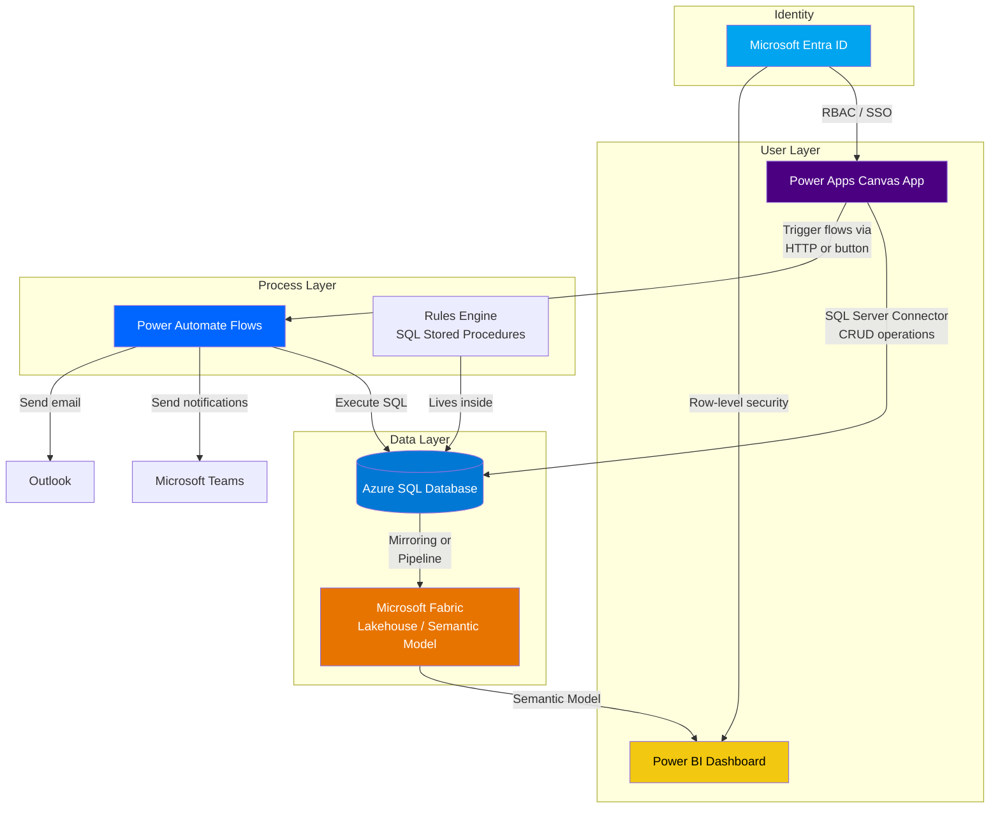
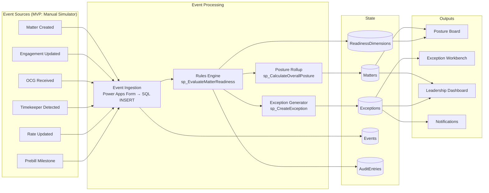
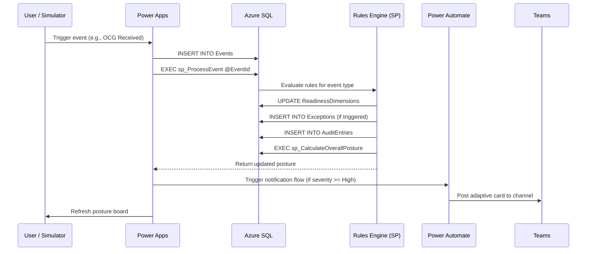
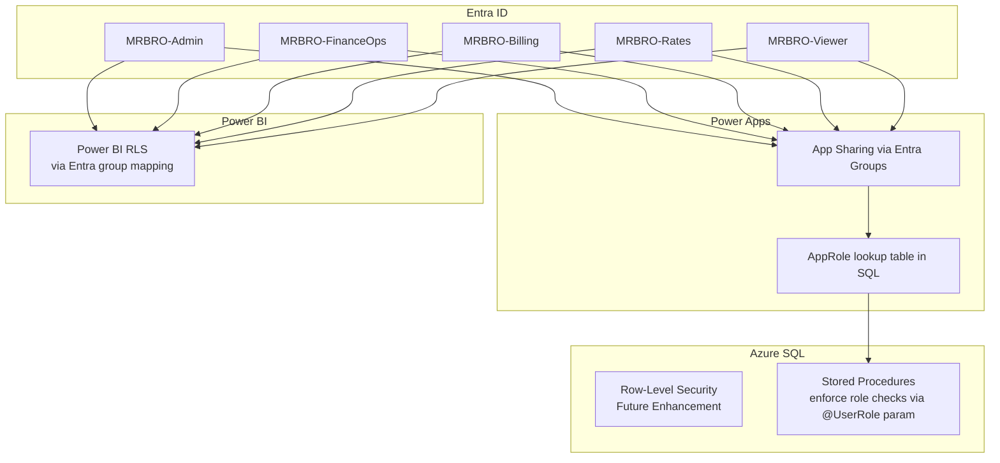

# Architecture: Matter Readiness and Billing Risk Orchestrator

## Architecture Decision Summary

**Decision:** Power Apps Canvas App + Azure SQL Database + Power Automate + Microsoft Fabric/Power BI

**Why this stack over alternatives:**

| Alternative | Why Not |
|---|---|
| Model-driven app | Too rigid for the multi-dimensional posture UX; canvas gives pixel-level control for the posture board |
| SharePoint lists as data store | Cannot handle relational integrity, complex views, or the audit trail volume at scale |
| Dataverse | Correct long-term, but adds licensing cost and DLP surface area for MVP; Azure SQL is more portable and schema-controllable |
| Custom web app (React/.NET) | Overkill for MVP; Power Apps gets us to demo faster with less infra |
| Logic Apps instead of Power Automate | Power Automate stays in the maker ecosystem; Logic Apps adds Azure subscription management overhead |

**Key architectural constraints:**
- No AI connectors assumed available (feature-flagged if present)
- Conservative DLP profile: SQL Server connector, Office 365 Outlook, Microsoft Teams, SharePoint (standard connectors only)
- No custom connectors in MVP; all integration via Azure SQL
- Event-driven logic lives in SQL + Power Automate, not in opaque AI flows

## Component Diagram

## Data Flow Diagram

## Event Processing Sequence

## Assumptions

1. **Azure SQL is provisioned** and accessible via the Power Platform SQL Server connector (standard connector, no premium required for on-prem gateway scenarios — but Azure SQL direct connection is standard-tier in most tenants)
2. **Power Apps per-user or per-app licensing** is available for the Finance Ops team (~20-50 users)
3. **DLP policies** allow: SQL Server connector, Office 365 Outlook, Microsoft Teams, SharePoint
4. **No custom connectors** in MVP — all complex logic pushed to SQL stored procedures
5. **Microsoft Fabric** is available for the analytics layer; if not, Power BI can connect directly to Azure SQL views
6. **Entra ID** groups exist or can be created for: `MRBRO-Admin`, `MRBRO-FinanceOps`, `MRBRO-Billing`, `MRBRO-Rates`, `MRBRO-Viewer`

## Constraints

- No real-time integration with practice management system (3E, Aderant, etc.) in MVP — event simulator replaces this
- No document parsing or OCG extraction — manual status updates only
- No AI/Copilot features unless explicitly feature-flagged
- Power Apps Canvas has a delegation limit of 2,000 rows by default (configurable to 100K in non-delegation scenarios); views and stored procedures handle server-side filtering
- All business rules are explicit, auditable, and editable in SQL — no black-box logic

## Security Architecture

**MVP approach:** The `Users` table stores role assignments. Power Apps reads the current user's email, looks up their role, and conditionally shows/hides screens and controls. This is "soft RBAC" — sufficient for internal demo, upgradeable to Entra-backed RLS later.
